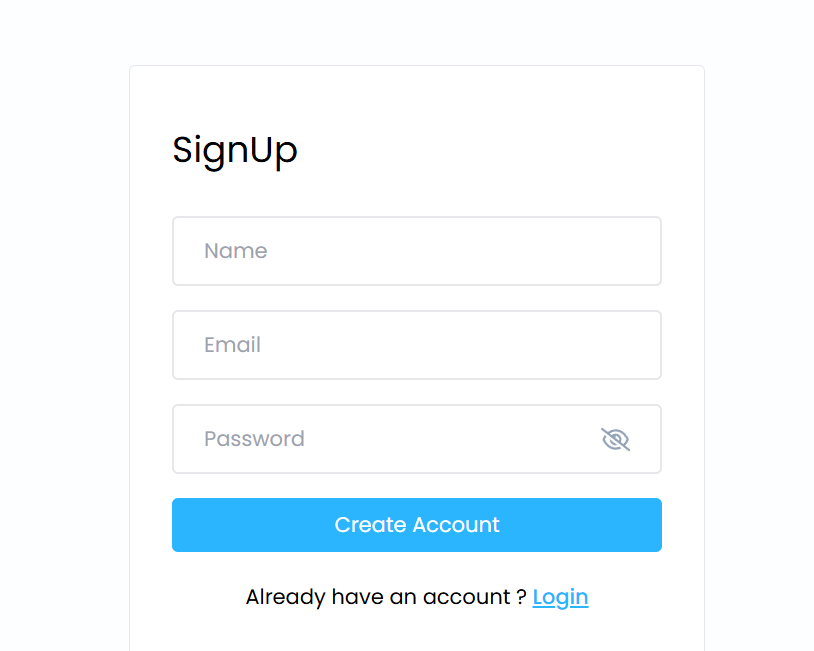

# News App 

Welcome to the News App! This application helps you stay up-to-date with the latest news and includes a notes section to help you increase your vocabulary. Users can sign up, log in, and add notes.

## Table of Contents
- [Features](#features)
- [Screenshots](#screenshots)
- [Installation](#installation)
  - [Frontend](#frontend)
  - [Backend](#backend)
- [Usage](#usage)
- [Technologies Used](#technologies-used)
- [Contributing](#contributing)
- [License](#license)
- [Contact](#contact)

## Features
- View the latest news articles.
- Sign up and log in to your account.
- Add, edit, and delete notes to improve your vocabulary.
- Responsive design for mobile and desktop.

## Screenshots


## Installation

### Frontend
1. Clone the repository:
    ```bash
    git clone 
    cd frontend/notes-app
    ```

2. Install dependencies:
    ```bash
    npm install
    ```

3. Start the frontend development server:
    ```bash
    npm start
    ```

### Backend
1. Navigate to the backend directory:
    ```bash
    cd ../backend
    ```

2. Install dependencies:
    ```bash
    npm install
    ```

3. Create a `.env` file and add your environment variables:
    ```plaintext
    PORT=4000
    MONGODB_URI=your_mongodb_connection_string
    JWT_SECRET=your_jwt_secret
    ```

4. Start the backend server:
    ```bash
    npm start
    ```

## Usage
1. Open your browser and navigate to `http://localhost:3000` for the frontend.
2. Sign up for a new account or log in if you already have one.
3. Browse the latest news articles.
4. Use the notes section to add new words and their definitions.

## Technologies Used
- **Frontend**: React, Tailwind CSS, Framer Motion
- **Backend**: Node.js, Express, MongoDB
- **Authentication**: JWT (JSON Web Tokens)

## Contributing
Contributions are welcome! Please follow these steps:
1. Fork the repository.
2. Create a new branch: `git checkout -b feature-name`.
3. Make your changes and commit them: `git commit -m 'Add new feature'`.
4. Push to the branch: `git push origin feature-name`.
5. Submit a pull request.

## License
This project is licensed under the MIT License.

## Contact
Created by MansiBansal - feel free to contact me!

